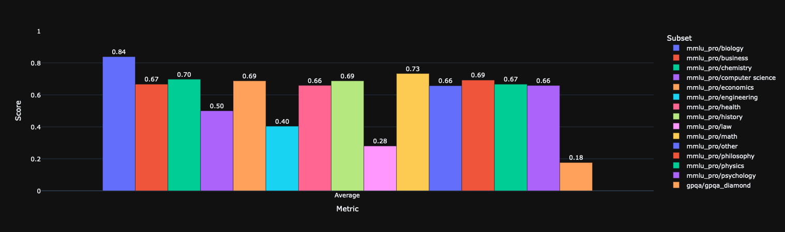
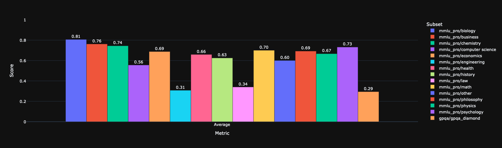
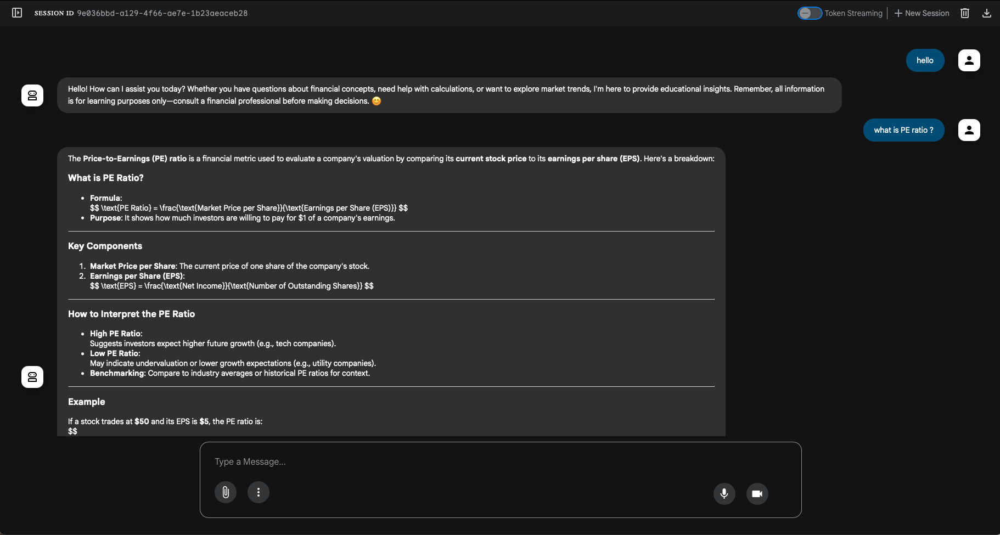

# Qwen-Finance-LLM

#### Description
This project delivered a financial conversational agent powered by Qwen3-8B LLM, delivering real-time financial Q&A, investment analysis, stock lookups, and news analysis.
This project optimized SFT training on limited GPU resources with QLoRA + FlashAttention, reducing memory usage by 80%+ and doubling throughput; Applied GRPO post-training with a Qwen3-14B reward model deployed via vLLM, aligning outputs with LLM model preferences. Boosting business evaluation performance by 13%. Built a real-time query system by integrating Google AgentSDK and Alpha Vantage MCP Server, enabling seamless access to live stock data and news.

#### Contents
dataset: dataset cleaning, dataset formatting and dataset mixing
Qwen-SFT: supervised finetuning
Qwen-GRPO: grpo reinforcement learning
Qwen-Agent: Google ADK agent, which relies on Alpha Vantage MCP Server
Qwen-VLLM: 
    * deploy Qwen-14B model as GRPO reward model.
    * deploy Qwen-8B SFT and GRPO post training model for evaluation. 
    * deploy Qwen-8B post training model for Qwen-Agent.

#### Model Evaluation Matrix

#### Google ADK Agent Demo

